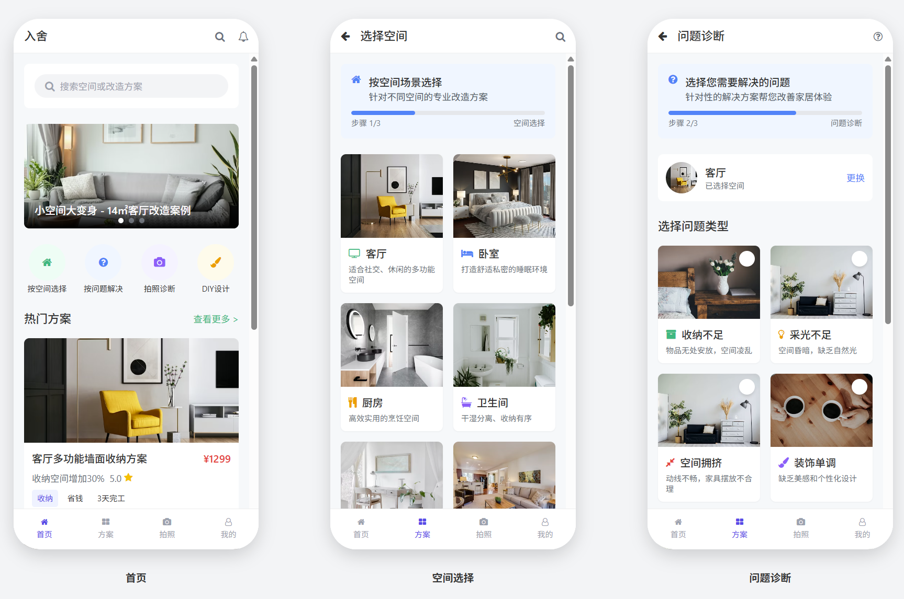
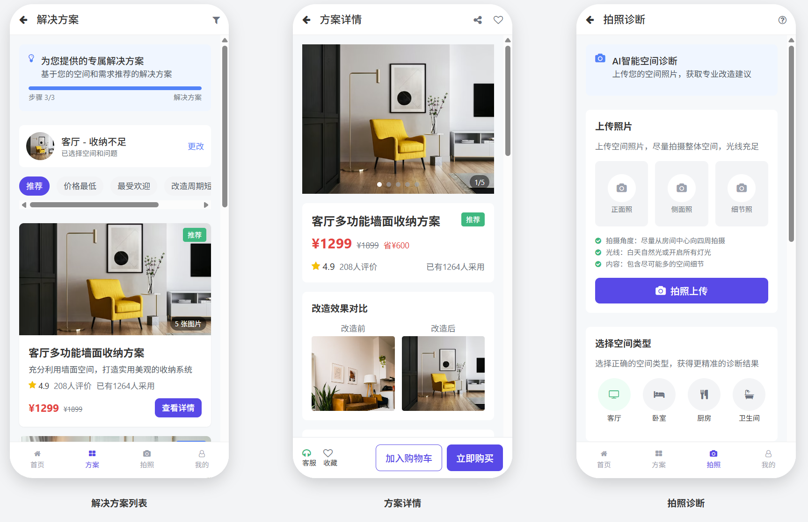
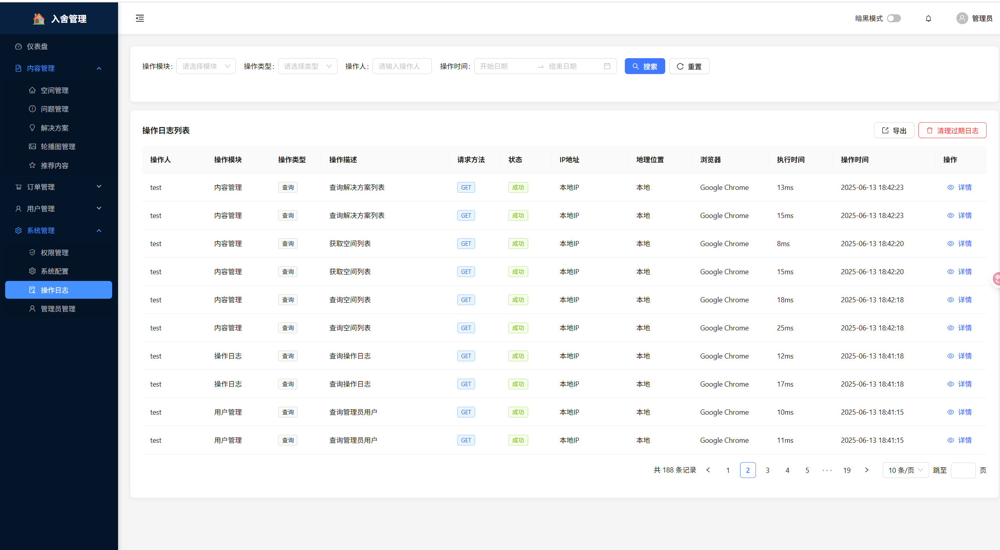

# 灯塔家居改造小程序

一个基于微信小程序的家居改造解决方案平台，帮助用户发现和解决家居问题。

# 快照UI




## 项目结构

```
lightHouseChange/
├── src/                    # 微信小程序前端代码
│   ├── api/               # API接口配置
│   ├── components/        # 公共组件
│   ├── pages/            # 页面文件
│   ├── static/           # 静态资源
│   └── utils/            # 工具函数
├── backend/              # Spring Boot后端服务
│   ├── src/              # Java源代码
│   ├── pom.xml           # Maven配置
│   └── README.md         # 后端说明文档
└── README.md             # 项目说明文档
```

## 功能特性

### 前端功能
- 🏠 **空间管理**: 支持客厅、卧室、厨房、卫生间等空间类型
- 🔍 **问题诊断**: 针对不同空间的常见问题提供解决方案
- 📱 **轮播展示**: 首页轮播图展示热门改造方案
- 💡 **解决方案**: 丰富的家居改造解决方案库
- 👤 **用户中心**: 个人信息管理和历史记录

### 后端功能
- 🚀 **RESTful API**: 提供完整的后端接口服务
- 📊 **数据管理**: 空间、问题、解决方案数据管理
- 🔧 **健康检查**: 系统状态监控和API信息查询
- 📋 **轮播管理**: 首页轮播图内容管理

## 技术栈

### 前端
- **框架**: uniapp+vue3 微信小程序开发
- **UI**: 自定义组件库
- **状态管理**: 页面级状态管理
- **网络请求**: uni.request封装

### 后端
- **框架**: Spring Boot 3.4.5
- **数据库**: MySQL
- **构建工具**: Maven
- **API文档**: 内置接口文档

## 快速开始

### 前端开发
0. 先使用 npx degit dcloudio/uni-preset-vue#vite-ts 项目名称, 创建环境。具体参考：https://ask.dcloud.net.cn/article/37834
1. 使用HBuilderX 4.6 版本打开该项目, 运行到小程序端模拟器或使用npm run dev:mp-weixin
2. 使用微信开发者工具打开`dist`目录即可
3. 配置后端API地址（默认: http://localhost:8081/api）
4. 编译并预览

### 后端开发
1. 进入backend目录
2. 运行 `mvn spring-boot:run`
3. 访问 http://localhost:8081

## API接口

### 已实现接口
- `GET /api/spaces` - 获取空间类型列表
- `GET /api/problems` - 获取问题类型列表
- `GET /api/banners` - 获取轮播图数据
- `GET /api/health` - 健康检查

### 接口文档
访问后端服务后，可通过以下接口获取API信息：
- `GET /api/health/info` - 获取API详细信息

## 开发状态

- ✅ 基础架构搭建完成
- ✅ 前后端API集成完成
- ✅ 轮播图功能实现
- ✅ 空间和问题管理功能
- 🚧 解决方案详情页面开发中
- 🚧 用户系统开发中

## 贡献指南

1. Fork 本仓库
2. 创建特性分支 (`git checkout -b feature/AmazingFeature`)
3. 提交更改 (`git commit -m 'Add some AmazingFeature'`)
4. 推送到分支 (`git push origin feature/AmazingFeature`)
5. 打开 Pull Request

## 许可证

本项目采用 MIT 许可证 - 查看 [LICENSE](LICENSE) 文件了解详情。 

### v1.2.1 2025-06-13
** 管理端后端api 和管理端前端上线
#### 新增功能
 - ✅ 内容管理
 - 系统管理

### v1.2.0 - 2025-06-01
**推荐内容API功能上线**

#### 新增功能
- ✅ 推荐内容管理系统
  - 新增 `recommendation` 数据表
  - 实现推荐内容CRUD操作
  - 支持热门推荐标记功能
  - 支持排序权重管理
  - 支持状态启用/禁用

#### 新增接口
- `GET /recommendations` - 获取推荐内容列表
- `GET /recommendations/hot` - 获取热门推荐内容
- `GET /recommendations/{id}` - 获取推荐内容详情
- `POST /recommendations` - 创建推荐内容
- `PUT /recommendations/{id}` - 更新推荐内容
- `DELETE /recommendations/{id}` - 删除推荐内容

#### 前端集成
- 更新 `getRecommendations()` 接口，从Mock数据改为调用后端API
- 更新 `getHotSolutions(limit)` 接口，从Mock数据改为调用后端API
- 保持数据结构兼容性，确保前端无缝切换

#### 数据库更新
- 新增 `recommendation` 表结构
- 插入6条初始化推荐内容数据
- 包含3条热门推荐内容

#### 技术改进
- 使用MyBatis-Plus自动填充功能
- 实现完整的分层架构（Entity、Mapper、Service、Controller）
- 添加详细的接口文档和使用说明